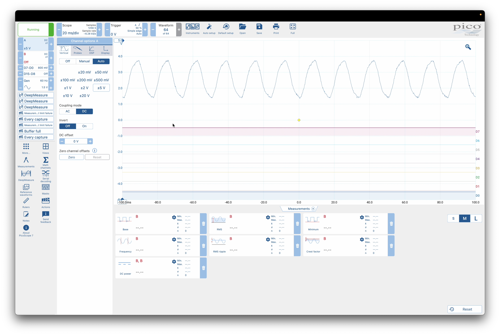
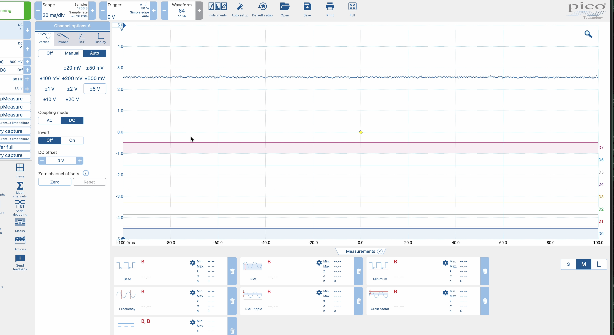
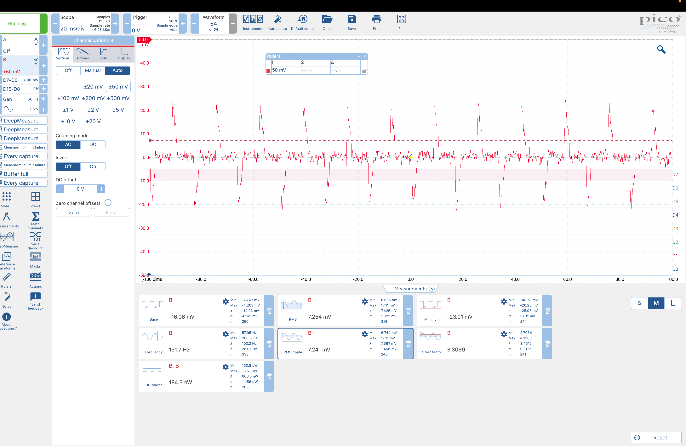

# Arquitectura Técnica

{: .fs-8 }

Dos procesadores con responsabilidades deliberadamente separadas — porque la inferencia y la comunicación no pueden compartir el mismo cuello de botella.
{: .fs-5 .fw-300 }

---

## El principio que gobierna cada decisión

Un sistema de protección eléctrica **no puede depender de la nube ni tolerar latencias de red.** El dispositivo se instala junto al tablero eléctrico del hogar y opera de forma completamente autónoma, incluso cuando el internet cae junto con la luz.

---

## Arquitectura dual MCU + MPU

### MCU · STM32U585 — Tiempo real puro

{: .fs-5 }

El microcontrolador se dedica exclusivamente a tareas de tiempo real:

- Muestreo ADC a **1 kHz** (ZMPT101B) y **~2 Hz** (ACS712, thread Zephyr con mutex)
- Inferencia de **3 modelos en paralelo**
- Activación del relay físico **< 1ms**
- Sin red, sin logs, sin OS — latencia cero

### Señales que el MCU procesa en tiempo real

_Señal normal de 60 Hz — el baseline que el modelo aprende a reconocer._



_Señal de outage — RMS cae 164x. El modelo lo clasifica en la siguiente ventana de 200 ms._



_Señal con ruido de red — el perfil de ruido que usamos para augmentation del dataset._



---

### MPU · QRB2210 — Inteligencia de contexto

{: .fs-5 }

El microprocesador gestiona todo lo que requiere sistema operativo:

- **Lógica de predicción compuesta:** historial de las últimas 10 clasificaciones del MCU, evaluación de patrones antes de actuar
- Logger **SQLite** de eventos históricos
- Dashboard **Flask** + alertas **Twilio WhatsApp**
- OTA model updates vía **Foundries.io**

{: .note }

> Esta separación garantiza que, pase lo que pase en la red, **la respuesta física nunca se bloquee.** Un crash en el MPU no afecta la capacidad del MCU de activar el relay.

---

## Lógica de predicción compuesta

El relay no actúa en una sola detección — el MPU evalúa patrones:

```python
history = deque(maxlen=10)

if history.count('sag_leve') >= 3:   → alerta_amarilla (WhatsApp)
if history.count('sag_severo') >= 2: → alerta_roja → relay_off
```

Esto diferencia Tecovolt de un monitor pasivo: actúa **predictivamente** antes del colapso total.

---

## Stack de software e IA

| Herramienta                        | Propósito                                                                         |
| :--------------------------------- | :-------------------------------------------------------------------------------- |
| **Edge Impulse Studio**            | Entrenamiento de los 3 modelos. Custom DSP blocks con THD vía Python/ngrok/Docker |
| **Qualcomm AI Hub**                | Cuantización INT8. ~200 KB → ~50 KB por modelo                                    |
| **Arduino App Lab + Foundries.io** | Entorno oficial Uno Q. OTA updates en campo                                       |
| **Flask + SQLite**                 | Dashboard histórico en el MPU                                                     |
| **Twilio WhatsApp API**            | Alertas bidireccionales + comandos de relay                                       |

---

## Flujo de operación

```
┌─────────────────┐    ┌──────────────────┐    ┌─────────────────────┐
│ 1. Entrenamiento│    │ 2. Optimización  │    │ 3. Desarrollo y     │
│ Edge Impulse    │───▶│ Qualcomm AI Hub  │───▶│    Deploy           │
│ Studio          │    │                  │    │ Arduino App Lab     │
│ · 3 modelos     │    │ · Cuantización   │    │ · C/C++ en MCU      │
│ · Custom DSP    │    │   INT8           │    │ · Python en MPU     │
│ · 99.3% acc.    │    │ · Perfilado      │    │ · Entorno Uno Q     │
└─────────────────┘    └──────────────────┘    └──────────┬──────────┘
                                                           │
┌─────────────────┐    ┌──────────────────┐               ▼
│ 5. Notificación │    │ 4. Actualización │    ┌─────────────────────┐
│ Twilio WhatsApp │◀───│ Foundries.io OTA │◀───│   Nodo desplegado   │
│ · Alertas       │    │ · Remota         │    │ Evento de riesgo ──▶│
│ · Comandos      │    │ · Escalabilidad  │    │ Comando usuario ◀──│
└─────────────────┘    └──────────────────┘    └─────────────────────┘
```

---

## Comunicación MCU ↔ MPU

Vía **UART serial / Arduino_RouterBridge.h** con protocolo JSON ligero. El MCU usa `Bridge.provide()` para exponer funciones al MPU. El patrón de concurrencia usa mutex Zephyr para lectura continua de sensores sin bloquear el loop de inferencia:

```c
K_MUTEX_DEFINE(current_mutex);

void current_thread_fn(void*, void*, void*) {
    while(1) {
        // samplea 1000 veces @ 10kHz, calcula RMS
        k_mutex_lock(&current_mutex, K_FOREVER);
        currentRMS = amps;
        k_mutex_unlock(&current_mutex);
        k_msleep(500);
    }
}
```

---

## Seguridad y robustez

| Especificación    | Detalle                                                                              |
| :---------------- | :----------------------------------------------------------------------------------- |
| **Grado IP55**    | Caja sellada apta para instalación exterior                                          |
| **127V aislados** | Zona de alto voltaje físicamente separada mediante transformadores y optoacopladores |
| **Enclosure CAD** | Diseñado con todos los componentes posicionados, listo para impresión 3D             |
