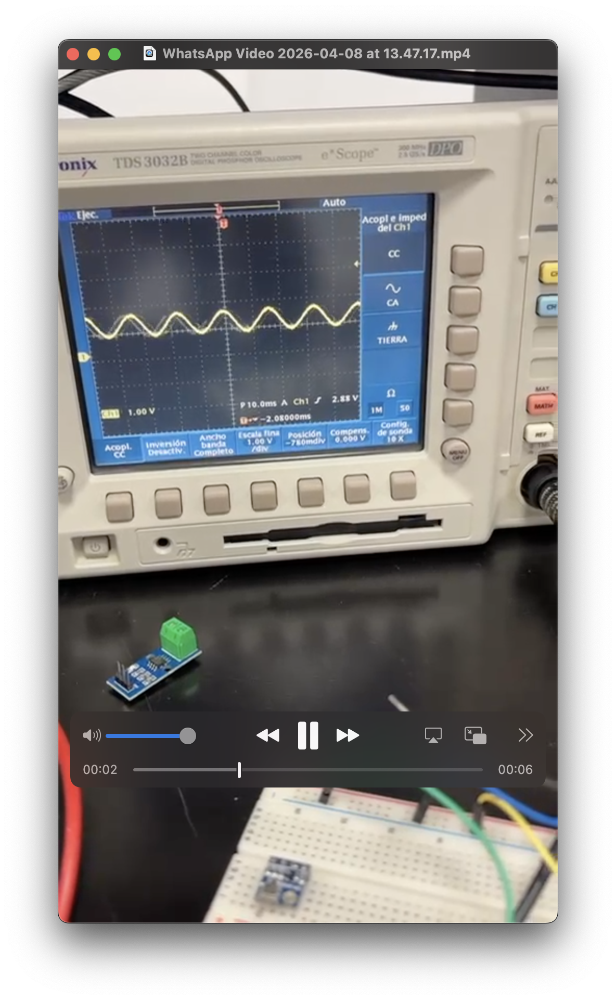

# Estrategia de Demo

{: .fs-8 }

Dos sistemas independientes, un fenómeno físico — la forma más sólida de convencer a un jurado técnico.
{: .fs-5 .fw-300 }

---

## El PicoScope no es decoración — es el árbitro

El PicoScope 2208B MSO actúa como **validador independiente**, no como display redundante. Muestra la waveform física en tiempo real mientras Tecovolt clasifica y actúa el relay. Cuando dos sistemas independientes muestran el mismo fenómeno simultáneamente, la detección no se puede cuestionar.

---

## Secuencia AWG automatizada — ~60 segundos de demo

El script `tecovolt_demo_awg.py` controla el AWG del PicoScope para reproducir la secuencia exacta que activa el relay:

| Fase               | Config AWG       | Duración | Qué muestra                         |
| :----------------- | :--------------- | :------- | :---------------------------------- |
| **normal**         | 1500 mV, 60.0 Hz | 8 s      | Baseline — red estable              |
| **sag_leve × 3**   | 1000 mV, 59.8 Hz | 3 s c/u  | Patrón acumulándose en el historial |
| **sag_severo × 2** | 600 mV, 59.5 Hz  | 4 s c/u  | **RELAY ACTÚA — 2do sag severo**    |
| **outage**         | 0 mV             | 6 s      | El relay ya protegió el circuito    |
| **normal**         | 1500 mV, 60.0 Hz | 5 s      | Recuperación                        |

{: .note }

> 1500 mV en el AWG corresponde a ~0.115 V RMS en el ADC del Arduino — equivalente a la red normal de 127V en México. El relay actúa en el 2do `sag_severo` porque el MPU necesita ≥2 en su historial de 10 ventanas, no una detección aislada.

---

## Argumento contra overfitting — prepárate para esta pregunta

El modelo tiene 99.3% accuracy. El jurado lo va a cuestionar. Las respuestas:

**Los fenómenos tienen diferencias físicas de órdenes de magnitud:**

| Clase        | RMS       | Diferencia vs normal               |
| :----------- | :-------- | :--------------------------------- |
| `normal`     | 0.1175 V  | —                                  |
| `outage`     | 0.0007 V  | **164x menor**                     |
| `sag_severo` | ~0.04 V   | ~3x menor                          |
| `flicker`    | ~0.1175 V | Idéntico en RMS — separado por THD |

**Train y validation convergen** — la curva no diverge, evidencia de generalización.

**El modelo aprendió física, no ruido.** Una diferencia de 164x no es un artefacto — es voltaje presente vs voltaje ausente.

**THD separa lo que RMS no puede.** `flicker` y `normal` tienen el mismo RMS. El modelo los distingue por distorsión armónica real — THD es 10–20x mayor en flicker.

---

## Los 6 diferenciadores para el pitch

| #   | Diferenciador                      | Por qué importa ante el jurado                                                  |
| :-- | :--------------------------------- | :------------------------------------------------------------------------------ |
| 1   | Tres modelos simultáneos en un MCU | Gestión de memoria embebida en 786 KB RAM                                       |
| 2   | INT8 via Qualcomm AI Hub           | ~200 KB → ~50 KB. De 12h a 72h de batería                                       |
| 3   | Separación MCU/MPU deliberada      | Inferencia < 1ms nunca bloqueada por red o crash                                |
| 4   | Relay físico                       | No es un dashboard — es una respuesta autónoma instalable                       |
| 5   | OTA via Foundries.io               | Flota de nodos actualizable sin tocar el hardware                               |
| 6   | DSP block custom con THD           | Detección de flicker por física armónica — imposible con bloques estándar de EI |
