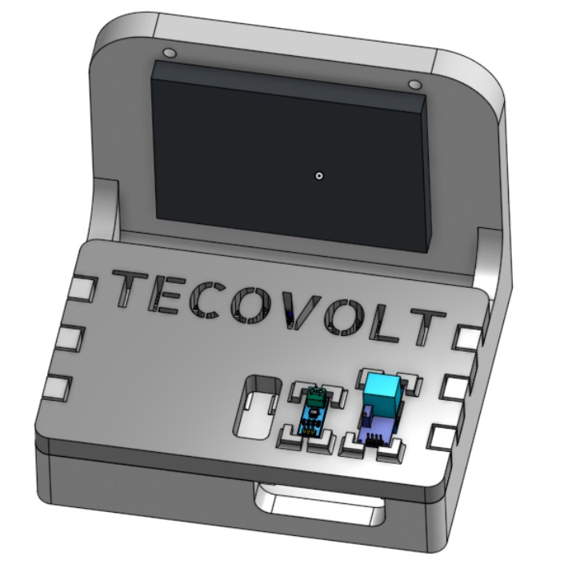
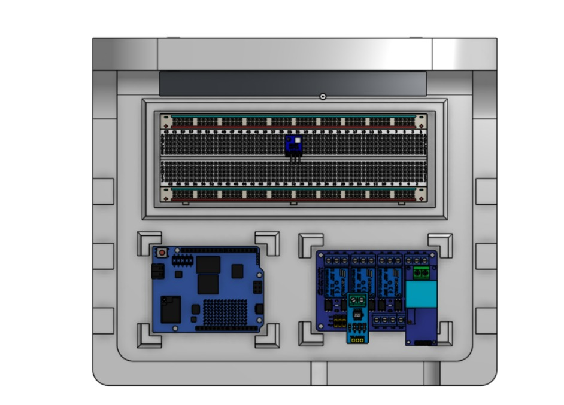

# Hardware

{: .fs-8 }

Bill of materials, sensores, actuadores y diseño físico del nodo Tecovolt.
{: .fs-5 .fw-300 }

---

## Bill of Materials

### Hardware

| Componente              | Modelo                   | Rol en el sistema                                       | Precio MXN |
| :---------------------- | :----------------------- | :------------------------------------------------------ | :--------- |
| **Arduino Uno Q 4GB**   | Qualcomm                 | Plataforma principal. MCU STM32U585 + MPU QRB2210 Linux | ~$1,200    |
| **Sensor voltaje AC**   | ZMPT101B                 | Mide voltaje RMS. Detecta sags, swells, micro-cortes    | ~$80       |
| **Sensor corriente**    | ACS712-30A               | Mide demanda de carga en tiempo real vía ADC            | ~$90       |
| **Sensor temp/humedad** | BMP280 / BME280          | Alimenta modelo de riesgo térmico en Edge Impulse       | ~$60       |
| **Módulo relay doble**  | 5V optoacoplado          | Desconecta cargas no críticas. Respuesta < 1ms          | ~$70       |
| **Batería LiPo**        | 5000 mAh + MT3608        | Resiliencia durante el apagón                           | ~$180      |
| **Osciloscopio**        | PicoScope 2208B MSO      | Validación y captura de datos. AWG integrado            | —          |
| **Prototipado**         | Caja, protoboard, cables | Materiales para el demo                                 | ~$200      |

### Software (todo gratuito)

| Herramienta                        | Rol                            |
| :--------------------------------- | :----------------------------- |
| **Edge Impulse Studio**            | Entrenamiento de los 3 modelos |
| **Qualcomm AI Hub**                | Cuantización INT8              |
| **Arduino App Lab + Foundries.io** | Desarrollo + OTA updates       |
| **Twilio**                         | Alertas WhatsApp               |

**Total estimado del prototipo: ~$1,920 MXN**
{: .fs-5 .fw-700 }

---

## Arduino Uno Q — La plataforma

El Arduino Uno Q de Qualcomm es el corazón del sistema. Su arquitectura de doble procesador permite la separación deliberada de responsabilidades:

| Procesador          | Specs                             | Rol                                                                                         |
| :------------------ | :-------------------------------- | :------------------------------------------------------------------------------------------ |
| **MCU (STM32U585)** | 786 KB RAM, 2 MB ROM, Zephyr RTOS | Ejecuta 3 modelos Edge AI en C/C++, latencia sub-milisegundo. ADC 12-bit (`ADC_MAX = 4095`) |
| **MPU (QRB2210)**   | 4 GB RAM, Linux                   | Python, Flask, SQLite, WiFi/Twilio                                                          |

---

## Sensores

### ZMPT101B — Voltaje AC

Transformador de voltaje miniatura. Señal analógica proporcional al voltaje de la red (0–250V AC). Se lee vía ADC del MCU a 1 kHz para alimentar el Modelo A de anomalías de voltaje.

**Configuración validada:** AC coupling centrado en 0V, ±2V. Con dos calentadores conectados:

- RMS: 831.4 mV
- Frequency: 60.02 Hz (nominal mexicana)
- Crest factor: 1.4445 (teórico senoidal pura: 1.414)

{: .note }

> **Para capturar outage real:** desconectar el ZMPT del tomacorriente durante la captura. Desconectar un calentador captura un transitorio de reconexión — el ZMPT sigue viendo la red completa.

### ACS712-30A — Corriente

Sensor de efecto Hall para corriente AC/DC hasta 30A. Sensibilidad nominal: 66 mV/A a 5V. Factor real medido empíricamente con divisor de voltaje a 3.3V: **10.52 mV/A**.

**Configuración validada: DC coupling a ±5V.**

{: .warning }

> **Lección de calibración:** en AC coupling a ±50mV el offset de 2.5V del ACS712 desaparece y solo queda ruido. La señal útil es ±400mV sobre ese offset — desaparece con la escala incorrecta. El ACS712 **requiere DC coupling** para ver el offset de 2.5V.

**Valores reales medidos:**

| Carga            | rawRMS       | Corriente real |
| :--------------- | :----------- | :------------- |
| Sin carga        | 0.00         | 0 A            |
| Un calentador    | 42.81 ± 0.21 | ~950 W         |
| Dos calentadores | 87.60 ± 0.23 | ~1900 W        |

{: .note }

> El multímetro reportaba 6.32A y 2.5V sin variación visible porque promedia el RMS y filtra transitorios de menos de 200ms — exactamente los fenómenos que Tecovolt detecta. El PicoScope es el único instrumento capaz de capturar estos eventos.

### BMP280 — Temperatura y humedad

Sensor ambiental para las condiciones del tablero eléctrico. Frecuencia: 1 Hz. Alimenta el Modelo C de riesgo térmico (Flatten block, clasificación simple).

---

## Actuador — Relay doble 5V

El relay optoacoplado cierra el loop de protección. Cuando la lógica compuesta del MPU detecta patrón de riesgo alto (≥2 clasificaciones `sag_severo` en historial de 10), el MCU activa el relay en **menos de 1ms** para desconectar cargas no críticas.

---

## Parámetros críticos del firmware

| Parámetro     | Valor            | Razón                                           |
| :------------ | :--------------- | :---------------------------------------------- |
| `ADC_MAX`     | 4095             | STM32U585 es 12-bit (NO 1023 del Arduino UNO)   |
| `SAMPLE_US`   | 1000             | 1ms = 1 kHz                                     |
| `N_SAMPLES`   | 200              | 200ms de ventana                                |
| Thread ACS712 | `k_usleep(1000)` | 1 kHz de muestreo. `k_usleep(100)` daría 10 kHz |

---

## Diseño físico

| Especificación       | Detalle                                                            |
| :------------------- | :----------------------------------------------------------------- |
| **Grado IP55**       | Caja sellada apta para instalación exterior                        |
| **Aislamiento 127V** | Transformadores + optoacopladores = aislamiento galvánico completo |
| **Enclosure CAD**    | Todos los componentes posicionados, listo para impresión 3D        |

La separación física entre la zona de alto voltaje (red eléctrica) y la zona de bajo voltaje (procesador) es crítica para la seguridad del usuario.
