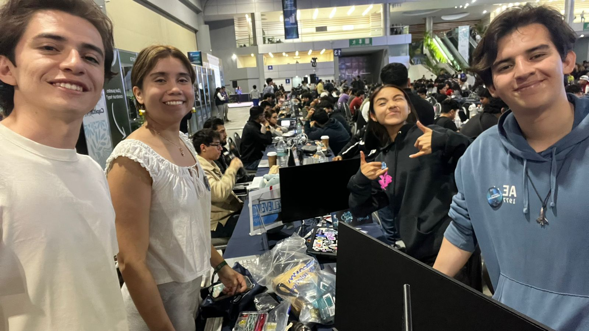

# Tecovolt ⚡

{: .fs-9 }

Un nodo inteligente que protege tu hogar antes de que llegue el apagón.
{: .fs-6 .fw-300 }

**Qualcomm Sustainable Power Cities · Genius Arena 2026**
{: .fs-4 }

[Leer la documentación](/Talent-Land-Slop-as-a-Service/problem/){: .btn .btn-primary .fs-5 .mb-4 .mb-md-0 .mr-2 }
[Ver en GitHub](https://github.com/JocelynVelarde/Talent-Land-Slop-as-a-Service){: .btn .fs-5 .mb-4 .mb-md-0 }

---

## ¿Qué es Tecovolt?

Tecovolt es un dispositivo embebido instalado junto al tablero eléctrico del hogar, construido sobre el **Arduino Uno Q de Qualcomm**, que detecta, anticipa y responde de forma autónoma a fallas en la red eléctrica. **Sin internet ni intervención humana.**

> No reacciona al apagón. Lo predice. El sistema actúa en el intervalo entre la anomalía y el colapso — el momento en que aún hay algo que proteger.

---

## Tres capacidades integradas

| ⚡ Detecta                                                                                                                 | 🛡️ Actúa                                                                                                  | 📱 Notifica                                                                                                 |
| :------------------------------------------------------------------------------------------------------------------------- | :-------------------------------------------------------------------------------------------------------- | :---------------------------------------------------------------------------------------------------------- |
| 3 modelos Edge AI en tiempo real: anomalías de voltaje (99.3% acc.), riesgo térmico y predicción de demanda. Sin internet. | Relay físico con respuesta < 1ms. Lógica de predicción compuesta que actúa antes del colapso, no después. | Alertas por WhatsApp con instrucciones concretas. Comandos remotos bidireccionales para controlar el relay. |

---

## Stack tecnológico

| Componente       | Tecnología                                                  |
| :--------------- | :---------------------------------------------------------- |
| **Plataforma**   | Arduino Uno Q (Qualcomm) — MCU STM32U585 + MPU QRB2210      |
| **Edge AI**      | Edge Impulse Studio — 3 modelos en paralelo, 99.3% accuracy |
| **Optimización** | Qualcomm AI Hub — Cuantización INT8 + perfilado energético  |
| **Actuación**    | Relay físico < 1ms — respuesta autónoma                     |
| **Comunicación** | Twilio WhatsApp — alertas bidireccionales                   |
| **OTA Updates**  | Foundries.io — actualizaciones remotas de modelos           |

---

## Equipo — Slop as a Service (SAAS)

**Bini Vázquez · Diego Pérez Rossi · Jocelyn Velarde Barrón · Armando Mac Beath**

Tecnológico de Monterrey · Monterrey / Puebla / CDMX

---

Navega por la documentación en la barra lateral para conocer la problemática, la solución, la arquitectura técnica, los modelos de IA, el hardware, la estrategia de demo y el análisis financiero.
