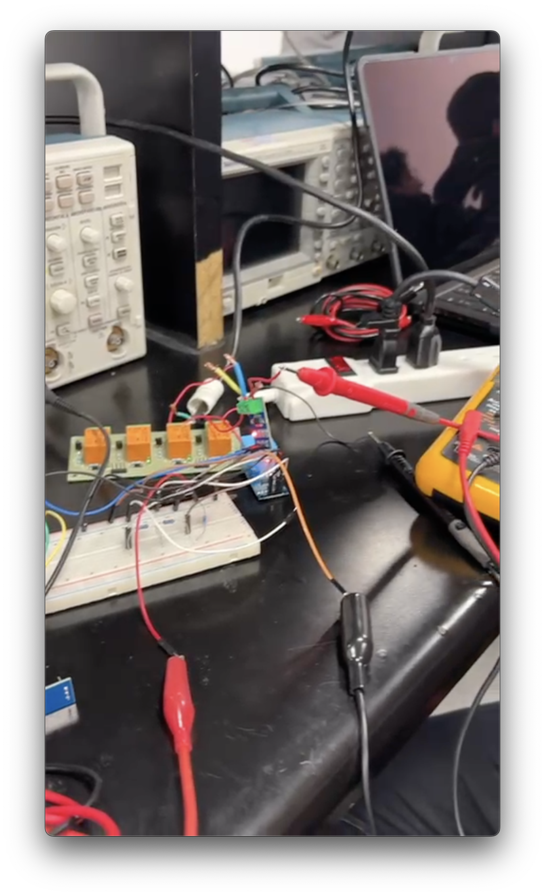

# Arquitectura Técnica

{: .fs-8 }

Diseño dual MCU + MPU, pipeline de datos, stack de software y flujo de operación.
{: .fs-5 .fw-300 }

---

## Principio de diseño

Un sistema de protección eléctrica **no puede depender de la nube ni tolerar latencias de red.** Cada decisión de diseño parte de ese principio. El dispositivo se instala junto al tablero eléctrico del hogar y opera de forma completamente autónoma, incluso cuando el internet cae junto con la luz.

---

## Arquitectura dual MCU + MPU

La decisión de diseño más importante es la **separación deliberada de responsabilidades** entre los dos procesadores del Arduino Uno Q:

### MCU · STM32U585 (C/C++ / Zephyr RTOS)

El microcontrolador se dedica exclusivamente a tareas de tiempo real:

- Muestreo ADC a **1 kHz** (ZMPT101B) y **~2 Hz** (ACS712, thread Zephyr con mutex)
- Inferencia de **3 modelos en paralelo**
- Activación del relay físico **< 1ms**
- Sin red, sin logs, sin OS — latencia cero


### MPU · QRB2210 (Python / Linux)

El microprocesador gestiona todo lo que requiere sistema operativo:

- **Lógica de predicción compuesta:** acumula historial de las últimas 10 clasificaciones del MCU y evalúa patrones antes de actuar
- Logger **SQLite** de eventos históricos
- Dashboard **Flask** + alertas **Twilio WhatsApp**
- OTA model updates vía **Foundries.io**

{: .note }

> Esta separación garantiza que, pase lo que pase en la red, **la respuesta física nunca se bloquee.** Un crash en el MPU no afecta la capacidad del MCU de activar el relay.

---

## Lógica de predicción compuesta (MPU)

El relay no actúa en una sola detección. El MPU evalúa patrones acumulados:

```python
history = deque(maxlen=10)

if history.count('sag_leve') >= 3:   → alerta_amarilla (WhatsApp)
if history.count('sag_severo') >= 2: → alerta_roja → relay_off
```

Esto diferencia Tecovolt de un monitor pasivo: actúa de forma **predictiva** — desconecta cargas no críticas para proteger el transformador local antes del colapso total.

---

## Stack de software e IA

| Herramienta                        | Propósito                                                                                                              |
| :--------------------------------- | :--------------------------------------------------------------------------------------------------------------------- |
| **Edge Impulse Studio**            | Entrenamiento de los 3 modelos. Custom DSP blocks (`tecovolt_block` con THD, `tecotemp_block`) vía Python/ngrok/Docker |
| **Qualcomm AI Hub**                | Cuantización INT8 y perfilado energético. Reducción de ~200 KB a ~50 KB por modelo                                     |
| **Arduino App Lab + Foundries.io** | Entorno oficial de desarrollo para Uno Q. OTA updates en campo                                                         |
| **Flask + SQLite**                 | Dashboard web histórico en el MPU. Logger de eventos                                                                   |
| **Twilio WhatsApp API**            | Canal de alertas bidireccional. Notificaciones de riesgo + comandos de relay                                           |

---

## Flujo de operación

```
┌─────────────────┐    ┌──────────────────┐    ┌─────────────────────┐
│ 1. Entrenamiento│    │ 2. Optimización  │    │ 3. Desarrollo y     │
│ Edge Impulse    │───▶│ Qualcomm AI Hub  │───▶│    Deploy           │
│ Studio          │    │                  │    │ Arduino App Lab     │
│                 │    │ · Cuantización   │    │                     │
│ · 3 modelos     │    │   INT8           │    │ · C/C++ en MCU      │
│ · Custom DSP    │    │ · Perfilado de   │    │ · Python en MPU     │
│ · 99.3% acc.    │    │   potencia       │    │ · Entorno Uno Q     │
└─────────────────┘    │ · Validación en  │    └──────────┬──────────┘
                       │   Dragonwing     │               │
                       └──────────────────┘               ▼
┌─────────────────┐    ┌──────────────────┐    ┌─────────────────────┐
│ 5. Notificación │    │ 4. Actualización │    │   Nodo desplegado   │
│ Twilio WhatsApp │◀───│ Foundries.io OTA │◀───│                     │
│                 │    │                  │    │ Evento de riesgo ──▶│
│ · Alertas       │    │ · Remota         │    │ Comando usuario ◀──│
│ · Comandos      │    │ · Gestión de     │    │                     │
│ · Control relay │    │   modelos        │    └─────────────────────┘
└─────────────────┘    │ · Escalabilidad  │
                       └──────────────────┘
```

---

## Seguridad y robustez

| Especificación    | Detalle                                                                                             |
| :---------------- | :-------------------------------------------------------------------------------------------------- |
| **Grado IP55**    | Caja sellada apta para instalación exterior junto al tablero eléctrico                              |
| **127V aislados** | Zona de alto voltaje físicamente separada del procesador mediante transformadores y optoacopladores |
| **Enclosure CAD** | Diseñado con todos los componentes posicionados, listo para impresión 3D                            |

---

## Comunicación serial MCU ↔ MPU

La comunicación entre procesadores ocurre vía **UART serial / Arduino_RouterBridge.h** con un protocolo JSON ligero. El MCU usa `Bridge.provide()` para exponer funciones al MPU. Fix aplicado: lectura carácter a carácter para manejar `\r\n` o `\r` (comportamiento del RouterBridge en Arduino App Lab).

El patrón de concurrencia en el MCU usa mutex Zephyr para lecturas de sensor en thread dedicado:

```c
K_MUTEX_DEFINE(current_mutex);

void current_thread_fn(void*, void*, void*) {
    while(1) {
        // samplea 1000 veces @ 10kHz, calcula RMS
        k_mutex_lock(&current_mutex, K_FOREVER);
        currentRMS = amps;
        k_mutex_unlock(&current_mutex);
        k_msleep(500);
    }
}
```




