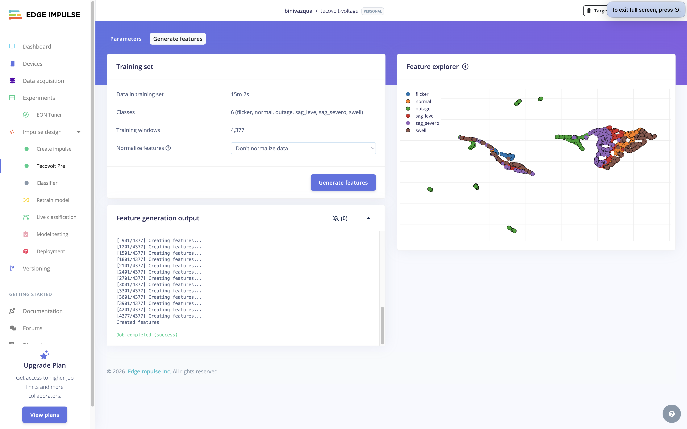
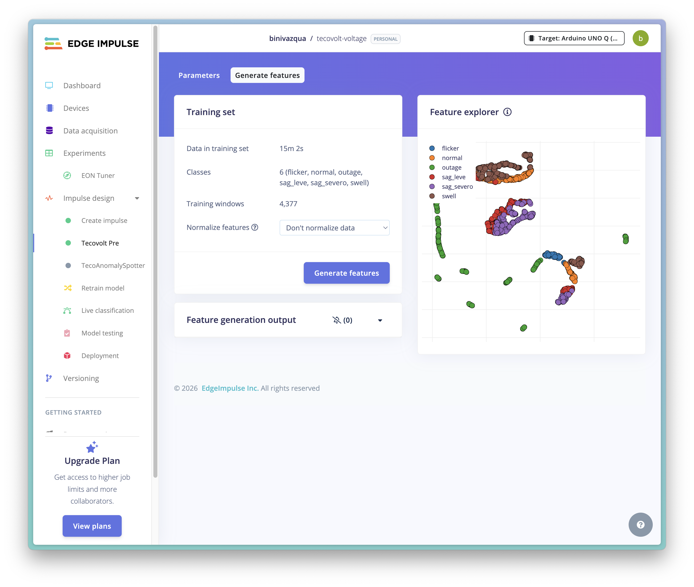
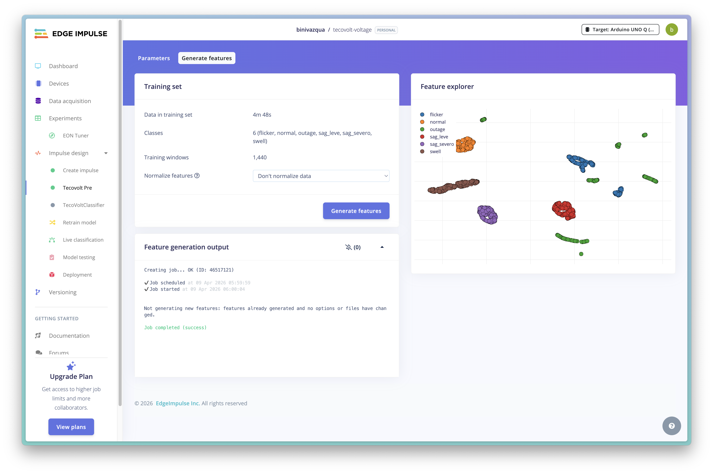
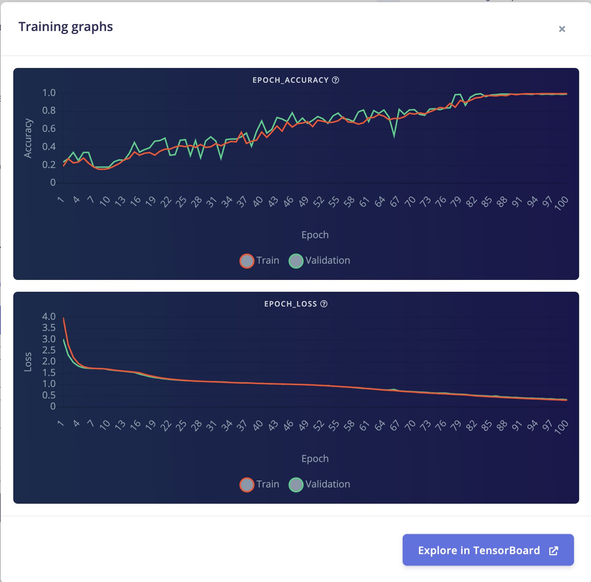

# Edge AI & Modelos

{: .fs-8 }

Tres modelos corriendo en paralelo en 786 KB de RAM — sin internet, sin latencia, sin excusas.
{: .fs-5 .fw-300 }

---

## Inferencia que sobrevive al apagón

Cuando la red eléctrica falla, el internet del hogar suele irse con ella. Por eso entrenamos en **Edge Impulse Studio** con datos reales de voltaje residencial y llevamos los modelos al **Qualcomm AI Hub** para cuantizarlos a INT8.

El resultado es un modelo que vive dentro del Arduino, aprende el comportamiento específico de cada red eléctrica y toma decisiones autónomas sin depender de una sola petición a internet.

---

## Modelo A · Anomalía de voltaje

> De 94.5% a 99.3% en cuatro iteraciones — y un bug que lo explica todo.
> {: .fs-5 .fw-300 }

| Parámetro           | Valor                                                            |
| :------------------ | :--------------------------------------------------------------- |
| **Proyecto EI**     | tecovolt-voltage                                                 |
| **Tipo**            | Clasificador de 6 clases                                         |
| **Bloque DSP**      | Custom `tecovolt_block` — 6 features físicas vía Python/ngrok    |
| **Frecuencia**      | 1000 Hz                                                          |
| **Ventana**         | 200 ms (200 samples), stride 200 ms                              |
| **Arquitectura NN** | Dense 16 → Dense 8 → Softmax 6 clases                            |
| **Training cycles** | 100, lr=0.001                                                    |
| **Accuracy final**  | **99.3% validation, AUC=1.00**                                   |
| **Clases**          | `normal`, `sag_leve`, `sag_severo`, `swell`, `outage`, `flicker` |

### Las 6 features que ven lo que el multímetro no puede

| Feature              | Descripción                                                                   |
| :------------------- | :---------------------------------------------------------------------------- |
| **rms_v**            | Voltaje RMS — la más discriminante: outage vs normal = diferencia de 164x     |
| **peak_to_peak_v**   | Diferencia máximo–mínimo de la ventana                                        |
| **crest_factor**     | Peak / RMS — detecta distorsión de forma de onda                              |
| **rms_ripple_v**     | Variabilidad del RMS por ciclo — detecta inestabilidad                        |
| **dominant_freq_hz** | Componente frecuencial dominante vía FFT                                      |
| **thd**              | Total Harmonic Distortion — la única feature que separa `flicker` de `normal` |

{: .note }

> **¿Por qué THD?** `flicker` y `normal` tienen RMS casi idéntico (~0.1175 V). El flicker genera modulación de amplitud que produce armónicos de 2° y 3° grado. THD normal: 0.005–0.015. THD flicker: 0.15–0.30. Una diferencia de **10–20x** que ningún bloque estándar de Edge Impulse puede calcular.

### Distribución inicial de clases — el punto de partida

_Clases del dataset sintético v1 antes de la separación agresiva._



### Distribución prefinal — v3 antes del fix crítico

_Dataset mixto con THD pero bug de `fs` aún presente._



### Distribución final — v4, separación agresiva

_Dataset final con separación agresiva entre clases frontera._



### Historia de iteraciones

| Versión | Accuracy  | Notas                                                             |
| :------ | :-------- | :---------------------------------------------------------------- |
| v1      | 94.5%     | Dataset sintético puro, 5 features                                |
| v2      | 63.7%     | Dataset mixto. Confusión: `normal` ↔ `sag_leve`. Bug `fs` latente |
| v3      | 63%       | THD agregado. Collapse a `flicker`. Bug `fs` aún presente         |
| **v4**  | **99.3%** | Fix `fs` + separación agresiva en synth                           |

{: .warning }

> **Bug crítico resuelto en v4:** el DSP block tenía `fs=6279.8` hardcodeado (sample rate real del PicoScope) pero el dataset v2/v3 fue generado a 1000 Hz. Esto rompía RMS ripple y THD completamente. Fix: `fs = 1000.0` hardcodeado en `dsp.py`, alineado con el parámetro de Edge Impulse.

### Curvas de entrenamiento — sin overfitting

_Train y validation convergen — el modelo aprendió física, no ruido._



### Dataset

Dataset mixto real + sintético. Datos reales capturados con PicoScope 2208B MSO del ZMPT101B a 6279.8 Hz, submuestreados a 1000 Hz. Augmentation ×50 por captura real usando el perfil de ruido medido (std diff-to-diff). Para `outage` no se amplifica — solo ruido mínimo, la señal ya es ~0 V.

**Dataset final: 1440 train / 360 test — 6 clases balanceadas.**

---

## Modelo B · Demanda energética

> Tres niveles de carga eléctrica, valores anclados a mediciones reales con calentadores.
> {: .fs-5 .fw-300 }

| Parámetro           | Valor                                                 |
| :------------------ | :---------------------------------------------------- |
| **Proyecto EI**     | tecovolt-demand                                       |
| **Tipo**            | Clasificador de 3 clases                              |
| **Bloque DSP**      | Flatten — Average, RMS, Std deviation (normalizado)   |
| **Frecuencia**      | ~2 Hz (lecturas rawRMS del ACS712)                    |
| **Ventana**         | 10 muestras = 5 s                                     |
| **Arquitectura NN** | Dense 8 → Softmax 3 clases                            |
| **Clases**          | `baja` (rawRMS <8), `media` (~42.81), `alta` (~87.60) |

### Valores reales medidos — ACS712-30A

| Clase   | rawRMS       | Carga                      |
| :------ | :----------- | :------------------------- |
| `baja`  | 0.00         | Sin carga                  |
| `media` | 42.81 ± 0.21 | Un calentador (~950 W)     |
| `alta`  | 87.60 ± 0.23 | Dos calentadores (~1900 W) |

**Dataset final:** 638 train (600 sintéticos anclados a valores reales + 38 reales).

{: .note }

> A diferencia del modelo de voltaje, el modelo de demanda **sí requiere normalización.** Las 3 features están en la misma escala y el modelo necesita aprender proporciones, no valores absolutos.

{: .note }

> **Insight de diseño:** la corriente **no** debe mezclarse como feature en el modelo de voltaje. Un sag con calentador encendido se ve diferente a uno sin calentador — la corriente depende de las cargas del usuario, no de la calidad de la red.

---

## Modelo C · Riesgo térmico

> El tablero eléctrico también se calienta — y eso también es una señal de riesgo.
> {: .fs-5 .fw-300 }

| Parámetro      | Valor                                                                   |
| :------------- | :---------------------------------------------------------------------- |
| **Tipo**       | Clasificador de 3 clases                                                |
| **Bloque DSP** | Flatten (temperatura cambia lento — sin FFT)                            |
| **Frecuencia** | 1 Hz (BMP280)                                                           |
| **Ventana**    | 10 muestras = 10 s                                                      |
| **Clases**     | `bajo` (20–45 °C), `medio` (45–65 °C), `alto` (65–90 °C + baja humedad) |

Desarrollado por Jocelyn Velarde. Proyecto EI propio porque tiene bloque de procesamiento distinto.

---

## Custom DSP Blocks — más allá del toolbox estándar

Edge Impulse tiene bloques predefinidos. Nosotros los reemplazamos con Python propio, servido vía HTTP desde ngrok durante el entrenamiento.

**`tecovolt_block`** — Extrae las 6 features incluyendo THD. Implementado en `dsp.py`, servido por `dsp-server.py`. Fix aplicado: parámetros JSON con guiones (`scale-axes`) → underscores antes de pasar como kwargs.

**`tecotemp_block`** — Procesa ventanas de temperatura/humedad del BMP280.

---

## Lógica de predicción compuesta

El relay no actúa en una sola detección — el MPU evalúa patrones acumulados:

```python
history = deque(maxlen=10)

if history.count('sag_leve') >= 3:   → alerta_amarilla (WhatsApp)
if history.count('sag_severo') >= 2: → alerta_roja → relay_off
```

Esto diferencia Tecovolt de un monitor pasivo: actúa **antes** del colapso total.

---

## Pipeline de cuantización — de 200 KB a 50 KB

```
Edge Impulse Studio (float32)
        │
        ▼
Qualcomm AI Hub
   · Cuantización INT8
   · Perfilado de potencia
   · Validación en Dragonwing
        │
        ▼
Librería C++ INT8 (~50 KB por modelo)
        │
        ▼
Deploy en STM32U585 (786 KB RAM / 2 MB ROM)
```

El paso por Qualcomm AI Hub es la diferencia entre un nodo que dura **12 horas** de batería y uno que dura **72**.
